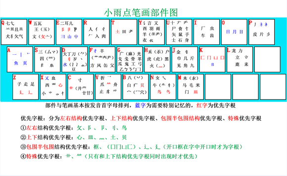

# 微软双拼+自然码辅助码 方案

### 安卓端
本项目主要针对 百度输入法APP

由于百度输入法不能直接挂载辅助码表，需要手动导入  个性短语（双拼+辅助码表）

### PC端
手心输入法和影子输入法均可直接挂载辅助码表

### 小工具

我制作了全拼转双拼程序，将“自然码辅助码表”重命名为“dict.txt”，即可一键转换，生成"new.txt"

自然码辅助码表格式

[辅助码]=[汉字]

由于精力有限，码表中生僻字还需时间维护...（欢迎PR，大家来一起肝）

### 致谢

自然码辅助码表来自影子输入法交流群331028595

全拼转双拼代码参考自：
https://github.com/MistEO/python-shuangpin

兄弟项目：
https://github.com/copperay/ZRM_Aux-code  （手心输入法 辅助码增强）

## 小雨点

小雨点辅助码拆分规则：

1、优先字根：分为左右结构优先字根、上下结构优先字根、包围半包围结构优先字根、特殊优先字根

①左右结构优先字根：攵、阝、卩、刂、鸟

②上下结构优先字根：心、皿、灬、土、贝

③包围半包围结构优先字根：框、（囗冂凵匚）、辶、廴（开口框在字中开口时才为字根）

④特殊优先字根：艹、（只有和上下结构优先字根同时出现时才优先）

2、取码规则：将字按左右、上下、包围半包围3种结构根据书写顺序分为两部分，每部分各取一码，组成一个两位的形码用以区分双拼的同音字。优先字根优先取，如优先字根在第一部分，则第二码取第二部分的尾码，（例字：左右结构—阳“阝日”、上下结构—字“宀子”、包围结构—国“口玉”）如优先字根在第二部分，则第二码取第一部分的首码。（例字：左右结构—郭“阝亠”、上下结构—惫“心攵”、半包围结构—过“辶寸”）左中右结构（特殊规则见第4条）及无优先字根字分别取首码和尾码。独体字按书写顺序取首码和尾码（有字根按字根，无字根按笔画）。

3、拆分规则：①取大优先：字根谁大则取谁，如“鞍”字首码可以是“廿”也可以是“革”，“革”大所以首码取“革”不取“廿”；

②相交不拆：一个字根如果与其他笔画或字根相交，则此字根被破坏而不再是原来的字根，取码时则不能再取，这样就免去了字中找字的麻烦，而可以简单直接的取相交字的首末笔画，如“中”字的“口”与笔画“丨”相交，“口”已被破坏，首码不能再拆为“口”，只能拆成笔画“丨”；类似的还有“夫”不能取“二”，“里、甲、申”不能取“日”。

③兼顾直观：字的拆分按书写顺序，同时兼顾字根的整体性，如“威”字按书写顺序首码为“一”，但为了直观，首码规定为“戈”；

4、特殊字型：

①类似“架”“餐”“辈”“毕”的这种倒品字型，（整体结构是上下结构，但是上半部分是由两个或多个小字根组成的左右或左中右结构的字型）第一码取在整个字中占有比例较大的字根（下半部分），第二码取剩余部分的首码，如占有比例较大的部分不是字根则按顺序首尾取码（例字：架—“木力”、辈—“车丨”）、整（较大部分“正”不是字根）取“一止”）；

②左中右结构字如左右两部分为相同的字则第一码取中间部分首码，第二码取右边部分尾码（例字：辫—“纟十”、斑—“文王”）；

③类似“载”“武”的这种字型，第一码取紧挨着“”“弋”的左下部分的首码（例字：栽—先取“木”、载—先取“车”、武—先取“止”），第二码取“戈”或“丶”。