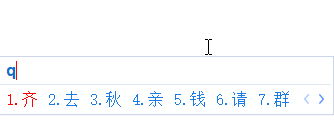

# 微软双拼+自然码辅助码 方案

### 安卓端
本项目主要针对 百度输入法APP

由于百度输入法不能直接挂载辅助码表，需要手动导入  个性短语（双拼+辅助码表）

### PC端
手心输入法和影子输入法均可直接挂载辅助码表

### 小工具

我制作了全拼转双拼程序，将“自然码辅助码表”重命名为“dict.txt”，即可一键转换，生成"new.txt"

自然码辅助码表格式

[辅助码]=[汉字]

由于精力有限，码表中生僻字还需时间维护...（欢迎PR，大家来一起肝）

### 致谢

自然码辅助码表来自影子输入法交流群331028595

全拼转双拼代码参考自：
https://github.com/MistEO/python-shuangpin

兄弟项目：
https://github.com/copperay/ZRM_Aux-code  （手心输入法 辅助码增强）